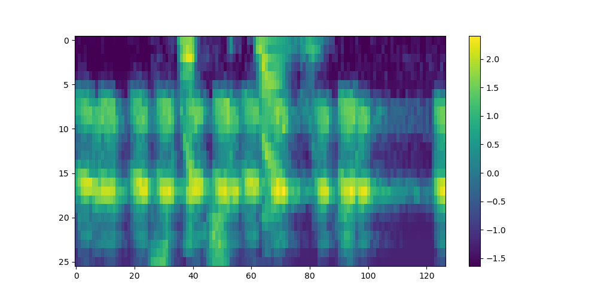
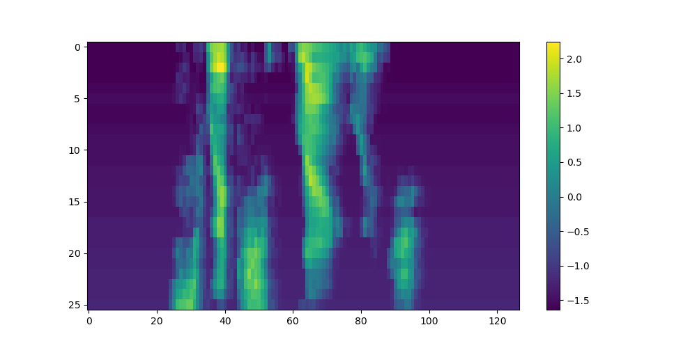
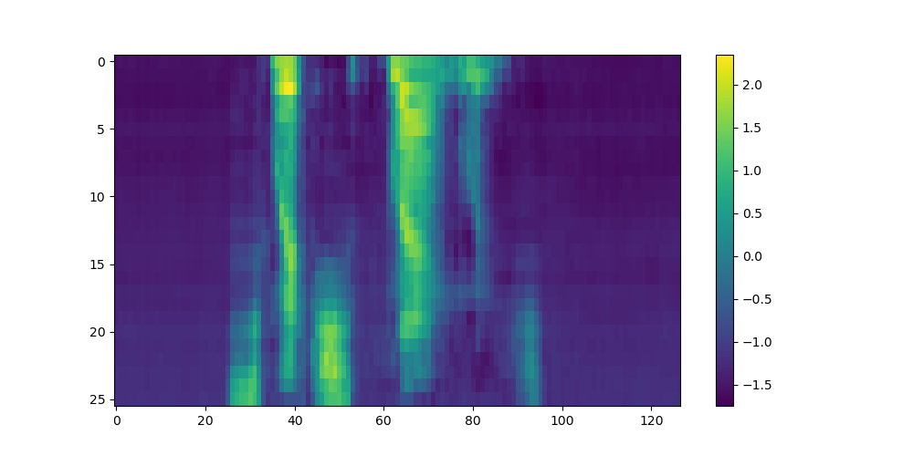

# Spectral Transformer

The **Spectral Transformer** repository demonstrates the versatility of transformer-based AI models in signal processing tasks, with a particular focus on **audio applications** like noise suppression. Unlike traditional transformer inputs consisting of tokenized text, this project adapts modern transformer architectures to work directly with **audio signals** represented as mel-spectrograms. The transformers are customized to accommodate this unique input format, enabling highly effective signal analysis and modification.

A key highlight is the integration of neural networks and digital signal processing (DSP) techniques. The results showcase the synergy of these approaches, achieving precise noise suppression while maintaining the **original signal's phase information**. Notably, this approach avoids the use of vocoders for audio reconstruction, ensuring higher fidelity in the output.

Even with a relatively simple transformer network, excellent performance can be achieved in real-world scenarios, as illustrated by the following example. Using the challenging task of separating human speech from background noise (e.g., frog sounds), the network demonstrates its robustness. Specifically:

1. **Signal with Noise** (Figure 1): This represents the input noisy speech signal, containing both human speech and frog sounds.

2. **Signal without Noise** (Figure 2): This is the clean speech signal, used as a reference for comparison.

3. **Cleaned Signal with Noise** (Figure 3): This is the output of the network, showing its ability to effectively suppress noise and isolate the speech signal, even on out-of-sample data.

## Attention Mechanism
Understanding the [attention mechanism](https://arxiv.org/html/1706.03762v7) is crucial for adapting deep learning architectures to various input formats. While most explanations utilize a sequence × embedding input format, this discussion emphasizes the embedding × sequence format as implemented in Julia. Additionally, this documentation aims to provide a comprehensive overview of the concepts that may initially seem challenging, breaking them down in a clear and accessible manner. By doing so, it not only facilitates modifications to input/output processing but also ensures the provided code is both intuitive and adaptable.

The attention mechanism is a foundational concept in modern deep learning architectures, such as the Transformer. It enables models to focus on specific elements of an input sequence when generating an output, capturing the relationships between elements of the sequence. This section provides a step-by-step explanation of how the attention mechanism operates for **a single attention head**, starting with input representation as matrices, followed by transformations into queries, keys, and values, and concluding with the computation of attention scores and outputs. Each step is described in terms of the matrix operations that underlie the mechanism.

---

### 1. **Input Representation as a Matrix**

The input sequence is represented as a matrix:

Let the sequence have $n$ elements, each represented by a vector of dimension $d$. The input sequence is then represented as:

$$
X \in \mathbb{R}^{d \times n}
$$

where each column corresponds to the representation of an element in the sequence.

---

### 2. **Linear Transformations to Obtain Query, Key, and Value**

Each element of the input sequence is transformed into three separate representations: **query ($Q$)**, **key ($K$)**, and **value ($V$)**. These are computed using learnable weight matrices. Since the input $X$ is $d \times n$, the transformation involves matrix multiplication:

$$
Q = W_Q X \quad \text{where} \quad W_Q \in \mathbb{R}^{d_k \times d}
$$

$$
K = W_K X \quad \text{where} \quad W_K \in \mathbb{R}^{d_k \times d}
$$

$$
V = W_V X \quad \text{where} \quad W_V \in \mathbb{R}^{d_v \times d}
$$

Here:
- $d_k$ is the dimension of the query and key vectors:  

- $d_v$ is the dimension of the value vectors:  

These weight matrices $W_Q$, $W_K$, and $W_V$ are learned during training, with each attention head independently learning its own set of weight matrices.

After the transformations:
- $Q \in \mathbb{R}^{d_k \times n}$,
- $K \in \mathbb{R}^{d_k \times n}$,
- $V \in \mathbb{R}^{d_v \times n}$.

---

### 3. **Attention Score Calculation**

The attention mechanism determines the relevance of each element in the sequence to every other element. This is done by computing a **similarity** score between queries and keys using a [dot product](https://en.wikipedia.org/wiki/Dot_product):

$$
\text{Attention Score} = K^T Q
$$

Where:
- $Q \in \mathbb{R}^{d_k \times n}$ (queries from all elements),
- $K^T \in \mathbb{R}^{n \times d_k}$ (keys transposed).

The result is:

$$
S \in \mathbb{R}^{n \times n}
$$

where $S_{ij}$ represents the relevance of the $j$-th element to the $i$-th element.

To stabilize training and avoid overly large values, these scores are scaled by $\sqrt{d_k}$:

$$
\text{Scaled Attention Score} = \frac{K^T Q}{\sqrt{d_k}}
$$

---

### 4. **Softmax to Compute Attention Weights**

The [softmax](https://en.wikipedia.org/wiki/Softmax_function) function is applied row-wise to the scaled attention scores to produce attention weights, ensuring that each row forms a probability distribution that sums to 1:

$$
A = \text{Softmax}\left(\frac{K^T Q}{\sqrt{d_k}}\right)
$$

For the $i$-th query, the attention weight for the $j$-th key is:

$$
A_{ij} = \frac{\exp(S_{ij})}{\sum_{k=1}^n \exp(S_{ik})}
$$

This results in the attention weights matrix $A \in \mathbb{R}^{n \times n}$, where each row represents how much each key contributes to the respective query.

---

### 5. **Weighted Sum Using Values**

The attention weights are used to compute a weighted sum of the value vectors:

$$
\text{Output} = V A
$$

Where:
- $V \in \mathbb{R}^{d_v \times n}$ (value representations),
- $A \in \mathbb{R}^{n \times n}$ (attention weights).

The result is:

$$
O \in \mathbb{R}^{d_v \times n}
$$

which is the output of the attention mechanism.

---

### Summary

In terms of matrix operations:

1. Compute query, key, and value matrices:

$$
Q = W_Q X, \quad K = W_K X, \quad V = W_V X
$$

2. Compute attention scores:

$$
S = \frac{K^T Q}{\sqrt{d_k}}
$$

3. Apply softmax to scores to get attention weights:

$$
A = \text{Softmax}(S)
$$

4. Compute the output as a weighted sum of values:

$$
O = V A
$$

## Multi-Head Attention Mechanism

To capture a diverse range of features and relationships in the input data, multi-head attention employs multiple attention "heads" that operate in parallel. Each head focuses on different aspects of the data by independently calculating attention outputs using its own learned weight matrices. This approach allows the model to process and integrate multiple perspectives simultaneously, enabling richer representations of the input.

### Parallel Attention Heads and Matrix Combination

Each of the $h$ attention heads computes its own output matrix:

$$
O_i = V_i A_i \quad \text{for } i = 1, 2, \dots, h,
$$

where $O_i \in \mathbb{R}^{d_v \times n}$ represents the output from the $i$-th attention head. To integrate these outputs, the results from all heads are stacked vertically into a single matrix:

$$
O_{\text{combined}} = 
\begin{bmatrix}
O_1 \\
O_2 \\
\vdots \\
O_h
\end{bmatrix} 
\in \mathbb{R}^{(h \cdot d_v) \times n}.
$$

This stacking operation forms a larger matrix where each attention head contributes a block of rows corresponding to its output. The result is a multi-faceted representation of the input that encapsulates the distinct features learned by each head.

### Dimensionality Constraints for Attention Heads

To ensure that the combined output aligns with the model's overall feature dimension $d$, the relationship between the number of attention heads ($h$), the dimension of each head’s output ($d_v$), and the total model dimension ($d$) must satisfy:

$$
h \cdot d_v = d,
$$

where:
- $d$ is the model’s total feature dimension,
- $h$ is the number of attention heads,
- $d_v$ is the feature dimension of each head.

This constraint ensures that the combined matrix $O_{\text{combined}}$ has a total of $d$ rows, regardless of how many heads are used. As the number of heads increases, the dimension of each head’s output ($d_v$) must decrease proportionally. This tradeoff balances the model's ability to focus on diverse features across heads with the capacity of individual heads to represent detailed patterns.

By stacking attention outputs in this way, multi-head attention integrates diverse insights from the input data while preserving a structured and scalable approach to feature representation.