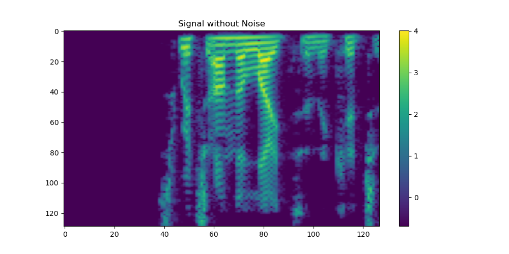
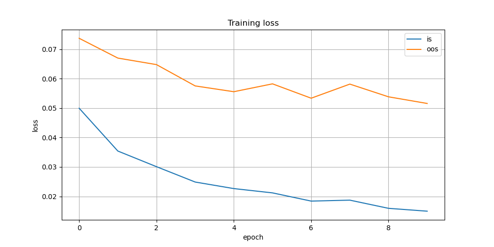

# Spectral Transformer  

The **Spectral Transformer** repository explores the application of transformer-based AI models in signal processing, particularly for **audio tasks** like noise suppression. Instead of tokenized text, this implementation processes **audio signals** as mel-spectrograms, adapting transformer architectures to handle this input format effectively.  

The project integrates neural networks with digital signal processing (DSP) techniques to enhance signal analysis and modification. This approach preserves the **original signal's phase information** while achieving precise noise suppression, eliminating the need for [vocoders](https://en.wikipedia.org/wiki/Phase_vocoder) in audio reconstruction and maintaining higher output fidelity.

## Results  

The transformer-based model demonstrates effective noise suppression in real-world scenarios, such as separating human speech from background noise (e.g., frog sounds). The following example illustrates its performance:  

1. **Noisy Input Signal** (Figure 1): The input audio contains both human speech and background noise.  
   -   
   - [Listen to noisy signal](https://github.com/anbjos/spectral-transformer/blob/main/figures/with_noise.wav) (Download Raw to play the audio)  

2. **Clean Reference Signal** (Figure 2): The clean speech signal serves as a reference for evaluation.  
   -   
   - [Listen to clean signal](https://github.com/anbjos/spectral-transformer/blob/main/figures/signal.wav) (Download Raw to play the audio)  

3. **Processed Output Signal** (Figure 3): The model’s output, where background noise is suppressed while retaining speech content.  
   -   
   - [Listen to processed result](https://github.com/anbjos/spectral-transformer/blob/main/figures/result.wav) (Download Raw to play the audio)  

This demonstrates the model’s ability to isolate speech from noise, even with previously unseen data.

## Transformer

This section presents a textbook description of the Transformer, which may be skipped by those already familiar with the concept. It provides a matrix representation aligned with the Julia format, where inputs are arranged as $inputs \times sequence$, unlike formats used in the [Attention Is All You Need](https://arxiv.org/html/1706.03762v7) paper. Additionally, it lays the groundwork for modifications needed to handle audio data instead of text, with the implementation following this structure.


### Attention Head

The attention mechanism is a foundational concept in modern deep learning architectures, such as the Transformer. It allows the model to capture relationships between elements in a sequence. This section provides a step-by-step explanation of how the attention mechanism operates for **a single attention head**, starting with input representation as matrices, followed by transformations into **queries (Q)**, **keys (K)**, and **values (V)**—all of which are *learned* representations rather than direct input data. The similarities between **Q** and **K** are then measured using a dot product, yielding weights that indicate how relevant each position is relative to the current query. These weights are subsequently applied to **V**, allowing the model to focus on and aggregate information from different parts of the sequence. Each step is described in terms of the matrix operations that underlie the mechanism.

#### 1. Input Representation as a Matrix

The input sequence is represented as a matrix:

Let the sequence have $n$ elements, each represented by a vector of dimension $d$. The input sequence to the attention head is then represented as:

$$
X \in \mathbb{R}^{d \times n}
$$

where **each column corresponds to the representation of an element in the sequence**.

#### 2. Linear Transformations to Obtain Query, Key, and Value

Each element of the input sequence is transformed into three separate representations: **query ($Q$)**, **key ($K$)**, and **value ($V$)** using weight matrices:

$$
Q = W_Q X \quad \text{where} \quad W_Q \in \mathbb{R}^{d_k \times d}
$$

$$
K = W_K X \quad \text{where} \quad W_K \in \mathbb{R}^{d_k \times d}
$$

$$
V = W_V X \quad \text{where} \quad W_V \in \mathbb{R}^{d_v \times d}
$$

Here:
- $d_k$ is the dimension of the query and key vectors.  
- $d_v$ is the dimension of the value vectors.


The weight matrices $W\_Q$, $W\_K$, and $W\_V$ are trained during the learning process, with each attention head independently learning its own set of weights. Each element in the input sequence is linearly mapped into a column in $Q$, $K$, and $V$.

After the transformations:
- $Q \in \mathbb{R}^{d_k \times n}$,
- $K \in \mathbb{R}^{d_k \times n}$,
- $V \in \mathbb{R}^{d_v \times n}$.

#### 3. Attention Score Calculation

The attention mechanism determines the relevance of each element in the sequence to every other element. This is done by computing a **attention** score between queries and keys using a [dot product](https://en.wikipedia.org/wiki/Dot_product). This score is then used to determine the influence that each key element have when computing the output representation for each query.:

$$
\text{Attention Score} = K^T Q
$$

Where:
- $Q \in \mathbb{R}^{d_k \times n}$ (queries from all elements),
- $K^T \in \mathbb{R}^{n \times d_k}$ (keys transposed).

The result is:

$$
S \in \mathbb{R}^{n \times n}
$$

where $S_{ij}$ represents the relevance of the $j$-th element to the $i$-th element.

To stabilize training and avoid overly large values, these scores are scaled by $\sqrt{d_k}$:

$$
\text{Scaled Attention Score} = \frac{K^T Q}{\sqrt{d_k}}
$$

#### 4. Softmax to Compute Attention Weights

The [softmax](https://en.wikipedia.org/wiki/Softmax_function) function is applied column-wise to the scaled attention scores to produce attention weights, ensuring that each column forms a probability distribution that sums to 1:

$$
A = \text{Softmax}\left(\frac{K^T Q}{\sqrt{d_k}}\right)
$$

For the $i$-th query, the attention weight for the $j$-th key is:

$$
A_{ij} = \frac{\exp(S_{ij})}{\sum_{k=1}^n \exp(S_{kj})}
$$

This produces the attention weight matrix $A \in \mathbb{R}^{n \times n}$, where each element $A_{ij}$ quantifies the contribution of the $j$-th key to the $i$-th query.

#### 5. Weighted Sum Using Values

The attention weights are used to compute a weighted sum of the value vectors:

$$
\text{Output} = V A
$$

Where:
- $V \in \mathbb{R}^{d_v \times n}$ (value representations),
- $A \in \mathbb{R}^{n \times n}$ (attention weights).

The result is:

$$
O \in \mathbb{R}^{d_v \times n}
$$

which is the output of the attention mechanism.

---
### Explanation Summary

The attention mechanism identifies and amplifies important relationships between sequence elements. Each column in $V$ represents an abstract [embedding](https://en.wikipedia.org/wiki/Word_embedding) of an element in the input to the attention head. The $j$-th column of $A$ represents the weighting of these embeddings for calculating the $j$-th element in the output, with the $i$-th element representing the weight of the $i$-th column in $V$.

The weight matrices $W_Q$, $W_K$, and $W_V$ are learned during training and independently map each input element (each column in $X$) to corresponding columns in the query, key, and value matrices. This independent transformation allows the model to capture the necessary relationships for effective task performance.

Even though the explanation focuses on the sequential nature of the inputs, it is important to emphasize that the primary motivation behind this architecture is to enable parallel processing. In other words, the entire input sequence is processed simultaneously within the attention head. 

---

## Multi-Head Attention Mechanism

Multi-head attention employs multiple attention "heads" operating in parallel, with each head focusing on different aspects of the input by independently computing attention outputs using its own learned weight matrices. This allows the model to capture a diverse range of features and relationships, resulting in richer input representations.

### Parallel Attention Heads and Matrix Combination

Each of the $h$ attention heads computes an output matrix:

$$
O_i = V_i A_i \quad \text{for } i = 1, 2, \dots, h,
$$

where $O_i \in \mathbb{R}^{d_v \times n}$ is the output of the $i$-th head. The outputs from all heads are stacked vertically to form a single matrix:

$$
O_{\text{MultiHead}} = 
\begin{bmatrix}
O_1 \\
O_2 \\
\vdots \\
O_h
\end{bmatrix} 
\in \mathbb{R}^{d \times n}.
$$

This stacking yields a unified matrix where each head contributes distinct features. The combined output adheres to the convention of having $d$ rows, enforcing the constraint $h \cdot d_v = d$.

---

## Attention Layer
The Transformer architecture, introduced in the paper [*Attention Is All You Need*](https://arxiv.org/html/1706.03762v7) (Vaswani et al., 2017), is built around the multi-head self-attention mechanism, supported by feed-forward layers and add and norm operations. This section focuses on these **support layers**, which, as shown in the architecture diagram below. 


The feed-forward layer increases the dimension to $d\_\text{ffn}$ (typically $4d$), which enables the model to capture richer and more complex features in a higher-dimensional space. Subsequently, the dimension is reduced back to $d$, ensuring the output remains manageable and compatible with the rest of the architecture, while still benefiting from the complex intermediate representations. Using [ReLU](https://en.wikipedia.org/wiki/Rectifier_(neural_networks)) as the [activation function](https://en.wikipedia.org/wiki/Activation_function) in the layer, this can be described as:

$$
\text{FeedForwardLayer}(X) = W_2 (\text{ReLU}(W_1 X + b_1)) + b_2
$$

where $W_1 \in \mathbb{R}^{d\_\text{ffn} \times d}$, $b_1 \in \mathbb{R}^{d\_\text{ffn}}$, $W_2 \in \mathbb{R}^{d \times d\_\text{ffn}}$, and $b_2 \in \mathbb{R}^{d}$.

To improve gradient flow, attention layers also apply [residual connections](https://en.wikipedia.org/wiki/Residual_neural_network). These signals are added to the processed signals, and the results are normalized to stabilize the gradients. Introducing the function [Normalization](https://en.wikipedia.org/wiki/Normalization_(machine_learning)) that take an input in $\mathbb{R}^{d \times n}$, we can write the processing in an attention layer as:

$$
\text{MultiHeadAttentionWithResidual}(X)=\text{Normalize}(X+\text{MultiHeadAttention}(X))
$$

$$
\text{FeedForwardWithResidual}(X)=\text{Normalize}(X+\text{FeedForwardLayer}(X))
$$

$$
\text{AttentionLayer}=\text{FeedForwardWithResidual} \circ \text{MultiHeadAttentionWithResidual}
$$

---

## Transformer Block

The system considered here is an **encoder**, composed of $N$ stacked **Transformer attention layers**, each integrating multi-head attention, feed-forward layers, and add and norm operations. These layers process input sequences into high-dimensional representations.

The original Transformer architecture, as introduced in [*Attention Is All You Need*](https://arxiv.org/html/1706.03762v7), included both an encoder and a decoder:

1. **Encoder**:
   - Processes input sequences into high-dimensional representations.
   - Fully parallelizable, making it efficient for non-generative tasks.

2. **Decoder**:
   - Generates output sequences token by token, attending to both encoder outputs and previously generated tokens.
   - Requires an **attention mask** during training to prevent "looking ahead."

While encoder-decoder configurations are used for tasks like translation and summarization (e.g., **BART**), encoder-only systems simplify training and are ideal for tasks such as classification and sound processing. Decoder-only models, like **ChatGPT**, focus on text generation.

---

### Example: Instantiating an Encoder Block in Julia

Using [Transformers.jl](https://github.com/chengchingwen/Transformers.jl):

```julia
using Transformers

# Instantiate an encoder block
transformer_block = TransformerBlock(
    model_dim = 512,       # Model dimension (d)
    num_heads = 8,         # Attention heads
    ffn_dim = 2048,        # Feed-forward dimension (d_ffn)
    num_layers = 6         # Number of layers (N)
)
```

Frameworks like [Transformers.jl](https://github.com/chengchingwen/Transformers.jl) provide modular implementations, enabling easy customization of encoder blocks. This example demonstrates how to set up a stack of $N$ attention layers for encoder-based tasks.

---

## Input and Output Embedding for Audio in the Frequency Domain

In our **noise suppression** application, we operate on **audio signals in the frequency domain** using a matrix $U \in \mathbb{R}^{d_U \times n}$, where:

- $d_U$ is the **feature dimension** (e.g., mel-frequency bins),
- $n$ is the **sequence length** (e.g., number of time frames).

### Input Embedding

Before passing $U$ into the Transformer, we apply an **Input Embedding** step that projects $U$ to the model’s embedding dimension $d$ using a linear layer:

$$\text{Embedding}(U) = W_{\text{emb}} U,$$

where $W_{\text{emb}} \in \mathbb{R}^{d \times d_U}$. Thus,

$$\text{Embedding}(U) \in \mathbb{R}^{d \times n}.$$

Each column of $\text{Embedding}(U)$ represents a sequence element, enabling the Transformer to process the audio data effectively.

### Output Projection

After the Transformer processes the embedded features, we convert the output back to the original audio feature space through an **Output Projection** step, implemented as another linear layer:

$$\text{OutputProjection}(Y) = W_{\text{out}} Y,$$

where $W_{\text{out}} \in \mathbb{R}^{d_U \times d}$ and $Y \in \mathbb{R}^{d \times n}$. Consequently,

$$\text{OutputProjection}(Y) \in \mathbb{R}^{d_U \times n}.$$

Both the **Input Embedding** matrix $W_{\text{emb}}$ and the **Output Projection** matrix $W_{\text{out}}$ are **learned independently** during training. There is **no enforced relationship** between them, allowing each to optimize its transformation for its specific role:

---

## Positional Encoding  

Without positional information, the model treats input embeddings as an unordered set, making it difficult to determine their order. This forces the model to learn relationships purely from data, without knowing which elements are adjacent—an inefficient approach. To address this, **positional encodings** are added to the input embeddings before feeding them into the model. These encodings provide explicit position information, allowing attention heads to infer order and relative positions within the sequence.

Positional encoding $\text{PE}(i, j)$ is defined as:  

$$
\text{PE}(i, j)=
\begin{cases}
\sin\left(\frac{j}{10000^{i/d}}\right), & \text{if } i \text{ is even}, \\
\cos\left(\frac{j}{10000^{(i-1)/d}}\right), & \text{if } i \text{ is odd}.
\end{cases}
$$

Where:  
- $j$ is the token’s position.  
- $i$ is the embedding dimension index.  
- $d$ is the embedding size.  

This generates a positional encoding matrix $\mathbf{P}$, where each column represents a token’s position. The visualization below shows that lower positions oscillate faster, while higher positions change more slowly.  

  

Multiplying positional embeddings of different positions and plotting the resulting **sequence × sequence** matrix reveals this pattern:  

  

The dot product between positional encodings defines a function measuring relative distance between positions. Since attention mechanisms compute **dot products between queries and keys**, they *can* capture positional relationships. However, since this also involves learned weights, the model can adjust its focus on absolute or relative positions based on training data.  

### Dot Product of Positional Embeddings  

#### 1. Positional Encoding as Columns  

The positional encoding matrix $\mathbf{P}$ has:  
- $d$ rows (embedding dimensions),  
- $n$ columns (positions $j$ in the sequence).  

Each position $j$ is represented as a column vector:  

$$
\mathbf{p}_j = \bigl[\sin\bigl(\tfrac{j}{\alpha_0}\bigr),\,\cos\bigl(\tfrac{j}{\alpha_0}\bigr),\,\sin\bigl(\tfrac{j}{\alpha_1}\bigr),\,\cos\bigl(\tfrac{j}{\alpha_1}\bigr),\,\dots\bigr]^\top
$$  

where $\alpha_k$ (typically $10000^{k/d}$) controls the frequency of the sine-cosine pairs.  

#### 2. Dot Product and Trigonometric Identity  

The dot product of two position vectors $p_j$ and $p_{j'}$ is:  

$$
\mathbf{p}_j^\top\mathbf{p}_{j'} = \sum_{k} \bigl[\sin\bigl(\tfrac{j}{\alpha_k}\bigr)\sin\bigl(\tfrac{j'}{\alpha_k}\bigr) + \cos\bigl(\tfrac{j}{\alpha_k}\bigr)\cos\bigl(\tfrac{j'}{\alpha_k}\bigr)\bigr].
$$  

Using the identity  

$$\sin(A)\sin(B) + \cos(A)\cos(B) = \cos(A - B),$$  

this simplifies to:  

$$\mathbf{p}_j^\top\mathbf{p}_{j'} = \sum_{k} \cos\Bigl(\frac{j - j'}{\alpha_k}\Bigr).$$  

#### 3. Capturing Relative Position  

Since the result depends only on $(j - j')$, positional encodings inherently encode **relative distance** between positions, which the model can use to infer sequential structure.

---

### Masking in the Encoder

In Transformer architectures, **masking** controls the flow of information during training. Within the **encoder**, masks primarily address varying sequence lengths and enforce causality, similar to their role in the **decoder**.

#### Purpose of Masking

1. **Handling Variable Sequence Lengths:**  
   Masks prevent the encoder from attending to padding tokens, ensuring that attention mechanisms focus only on meaningful data.

2. **Enforcing Causality:**  
   Masks restrict attention to previous positions in the sequence, maintaining the temporal order and preventing the model from accessing future information during training.

#### Current Application Context

In our **noise suppression** application, all input sequences have a **constant length**, eliminating the immediate need for masking. However, we retain the masking mechanism to support potential future enhancements, such as:

- **Variable-Length Inputs:** Allowing the model to handle audio samples of different duration's without structural changes.
- **Enhanced Feature Integration:** Facilitating the inclusion of additional features that may require selective attention controls.

By maintaining the masking infrastructure, we ensure that the model remains flexible and adaptable to evolving requirements, even though masking is not strictly necessary for the current fixed-length sequence setup.

---

### Model Summary

The **Spectral Transformer** suppresses audio noise through the following pipeline:

1. **Embedding and Positional Encoding**  
$$X=\text{PositionalEncoding}(\text{Embedding}(U))$$

2. **Transformer Processing and Output Projection**  
$$Y=\text{OutputProjection}(\text{Transformer}(X))$$

The corresponding model definition from the implementation is shown below:

```julia
struct Model
    position_embedding
    projection
    withmask 
    transformer
    antiprojection
end
 
model = Model(position_embedding, projection_layer, withmask, encoding_transformer, antiprojection_layer)
@functor Model (projection, transformer, antiprojection)

function (model::Model)(input)
    position = model.position_embedding(input.hidden_state)
    projection = model.projection(input.hidden_state)
    transformed = model.transformer((hidden_state = projection .+ position, attention_mask = input.attention_mask))
    result = (hidden_state = model.antiprojection(transformed.hidden_state), attention_mask = transformed.attention_mask)
    return result
end
```

Within the **Transformer.jl** framework, signals between blocks are represented as tuples. Specifically, the framework uses a `hidden_state` field to represent the actual data and an `attention_mask`. In this application, masking is included to support future enhancements, such as handling variable-length inputs.

The `@functor` macro is used in this framework to expose learnable weights for automatic differentiation during training.

## Audio Signal Processing

Before processing audio signals with the **Spectral Transformer**, they pass through a signal processing pipeline designed to structure the data for the neural network. Each step in this pipeline modifies the audio to improve model performance. The following sections describe these preprocessing steps and their role in preparing the signal for noise suppression.

---

### Short-Time Fourier Transform

The first step involves applying the [Short-Time Fourier Transform (STFT)](https://en.wikipedia.org/wiki/Short-time_Fourier_transform) to convert the audio signal from the time domain to a sequence of Short Fourier Transforms. This is done using an [FFT](https://en.wikipedia.org/wiki/Fast_Fourier_transform) length of $m$ and a modified [Hanning window](https://en.wikipedia.org/wiki/Hann_function):

$$h(k) = \sin^2\left(\frac{\pi k}{m}\right), \quad k \in [1 \dots m]$$

Although the first element of this window is not zero, it is still effective due to its smooth tapering, which minimizes spectral leakage. Overlapping windows (with a step size of $\frac{m}{2}$) ensure continuity, as the peak value (1) of one window aligns with the zero value of the previous, and the sum of overlapping window values is always 1. This simplifies signal reconstruction (see **Signal Reconstruction** for details).

The resulting STFT is given by:

$$X_{\mathbb{C}} = \text{stft}(u_{audio}, h, \text{step} = \frac{m}{2})$$

Here, the subscript $\mathbb{C}$ indicates that the resulting matrix is complex, containing both amplitude and phase information in the frequency domain. For a real input signal, the STFT returns the [DC component](https://en.wikipedia.org/wiki/DC_bias), positive frequencies, and the [Nyquist frequency](https://en.wikipedia.org/wiki/Nyquist_frequency), since negative frequencies are the complex conjugates of positive ones.

---

### Spectrogram

Since the transformer operates in the power domain, $X_{\mathbb{C}}$ is converted to a spectrogram by taking the squared magnitude of each element:

$$X_{P} = \text{spectrogram}(X_{\mathbb{C}})$$

Some scaling is applied during this process, depending on the data dimensions, but this is not critical due to subsequent normalization steps.

---

### Mel Representation

Human perception is more sensitive to variations in lower frequencies, which allows for reducing the dimensionality of data using a [Mel-frequency scale](https://en.wikipedia.org/wiki/Mel-frequency_cepstrum). In this application, only the Mel filtering step is applied, omitting the [Discrete Cosine Transform (DCT)](https://en.wikipedia.org/wiki/Discrete_cosine_transform).

This step involves a straightforward linear transformation:

$$X_M = dB(M \times X_P), \quad M \in \mathbb{R}^{d_U \times m}, \quad X_M \in \mathbb{R}^{d_U \times n}$$

A code snippet for constructing the Mel filter matrix $M$ can be found at [Practical Cryptography](http://practicalcryptography.com/miscellaneous/machine-learning/guide-mel-frequency-cepstral-coefficients-mfccs/) and can be easily adapted to Julia. The figure below illustrates the structure of the matrix $M$. Each graph corresponds to one row in $M$, with the axes representing the frequency bins and their respective weights in the summarization performed by the multiplication with $M$.


The following observations can be made:

1. The lowest frequencies outside the human voice spectrum are ignored.
2. The overlapping graphs have weights that sum to one, ensuring no energy loss within the Mel spectrum.
3. The width of the triangular graphs increases for higher frequencies due to the Mel scale construction.

The function [dB](https://en.wikipedia.org/wiki/Decibel) converts the power level to a logarithmic scale by applying:

$$dB(P) = 10 \log_{10}(P)$$

to each element in the matrix. This results in a double logarithmic representation.

---

### Power clamping

One issue with the logarithmic representation is that low power levels, which do not significantly contribute to the audio signal, are represented as large negative numbers. This can affect the training process, as the network may focus on these irrelevant values instead of the meaningful parts of the signal. To address this, the signal is clamped above a threshold, defined as the maximum power level of the signal or noise attenuated by 60 dB.

---

### Whitening

The final step before feeding the data to the model is **whitening**, which normalizes the signal by setting its mean to zero and standard deviation to one. This ensures consistent input statistics, improving training stability and convergence. The stored bias and scaling factors are later used to reverse the transformation on the model’s output, allowing correct reconstruction of the enhanced audio.

$$U=whiten(clamp(X_M))$$

## Audio Signal Reconstruction

Audio signal reconstruction is, in many ways, similar to audio processing but performed in the reverse order. However, several challenges remain, primarily because the transformer operates on data in the power domain, while an audio signal in the frequency domain is defined by both amplitude and phase. Additionally, the MEL spectral bank applies dimensionality reduction, which leads to a loss of information.

---

### Anti-Whitening

The scaling factors used during signal whitening were stored. In the anti-whitening process, these stored scaling factors are applied in reverse to restore the original signal scale.

### Anti-dB

The next step involves converting the signal representation from the logarithmic dB scale back to the power domain by applying the inverse transformation:

$$\text{antidB}(dB)=10^{\frac{dB}{10}}$$

### Attenuation

The result of anti-dB in in the form $Y_P \in \mathbb{R}^{d_U \times n}$. We want to consider $Y_P$ and $X_P \in \mathbb{R}^{m \times n}$ to come up with a attenuation that can be applied to $X_{\mathbb{C}}$. Applying the input processing chain to this attenuated version of $X_{\mathbb{C}}$ should then result in a $X_P$ that is identical with the model output $Y_P$ after anti whitening and anti-dB.

The problem is that $m \ge d_U$, meaning that our system is underdetermined and there therefore is many attenuations that achieve this. One way to get around this is to consider the MEL transformation, that can be considered as a dimention reduction from $m$ to $d_U$. This mean that each element in the MEL representation account for a number of bins in the original representation. To persue this approach, we first define the matrix $\tilde{M}$ where all all-zero columns are stripped off, thereby leaving bins that is not seen by the transformer out for now.

For each column $u_P$ in $U_P$, we aim to define an attenuation that can be applied to each element of $u\_P$. The attenuated version of $u\_P$ should yield the same power output during audio processing as the corresponding output $y$ from the transformer model, where $y$ is the column in $Y$ corresponding to $u\_P$.


$$\tilde{M}=\text{RegularRows}(M),\quad \tilde{M}\in\mathbb{R}^{\tilde{m}\times n}$$

$$\tilde{u}_P=\text{RegularRows}(u_P, M),\quad \tilde{u}_P\in\mathbb{R}^{\tilde{m}}$$

where $\tilde{m}$ represents the number of non-zero rows in $M$.

Next, we introduce $w\in\mathbb{R}^{\tilde{m}}$, where $\tilde{M}\cdot w$ represents the desired attenuation. The relationship is expressed as:

$$y=\tilde{M}\cdot \text{Diagonal}(\tilde{M}^{T}w)\cdot \tilde{u}\_P$$

Here, $\text{Diagonal}(\tilde{M}^{T} w)$ represents an attenuation applied to the vector $\tilde{u}\_P$. Since $U\_P$ represents power, this equation ensures that the attenuated version maintains the same power output. This can be rewritten as a linear system:

$$y=\tilde{M}\cdot \text{Diagonal}(\tilde{M}^{T} \cdot \tilde{u}\_P)\cdot w$$

From $w$, we can derive the attenuation we are seeking:

$$\text{PowerAttenuation}=\text{ReconstructRows}(clamp(\tilde{M}^{T} w,0,1), M)$$

Finally, we must account for the zero rows that were removed from $M$. To do this, we define the function $\text{ReconstructRows}(\tilde{u}\_P, M)$, which reinserts zeros at the positions of the discarded rows in $\tilde{u}\_P$. The reconstructed signal, representing the attenuated power, can then be written as:

$$
attenuation=[\sqrt{PowerAttenuation_{i,j}}]
$$

Where the square root is applied element wise.

The attenuation is then applied to the corresponding column of $X_{\mathbb{C}}$ to create $Y_{\mathbb{C}}$.

### Anti-STFT

The audio output signal is then created as:

$$
y_{audio}=antisftf(Y_{\mathbb{C}}, step=\frac{m}{2})
$$

Where $antisftr$ simply convert each $fft$ back into the time domain and add overlapping audio segment to reconstruct the cleaned audio signal.

---

## Data

The speech data are taken from the [fluent-speech-corpus](https://www.kaggle.com/datasets/tommyngx/fluent-speech-corpus?resource=download). This dataset consists of several speakers pronouncing a set of fixed commands. The speaker ID `7B4XmNppyrCK977p` was selected, and all sentences from this speaker were loaded. Sentences shorter than 2 seconds were discarded.

Noise samples are frog sounds taken from the [Environmental Sound Classification 50](https://www.kaggle.com/datasets/mmoreaux/environmental-sound-classification-50) dataset, which contains samples of various environmental sounds with a fixed duration of 5 seconds.

At this point, the samples are first shuffled and then split into 10% [out-of-sample](https://en.wikipedia.org/wiki/Cross-validation_(statistics)) data for verification and 90% [in-sample](https://en.wikipedia.org/wiki/Cross-validation_(statistics)) data for training. Both sets undergo the same processing pipeline.

All data are [sample-rate converted](https://en.wikipedia.org/wiki/Sample-rate_conversion) to a common sample rate of $f_s = 8192 \text{ Hz}$.

The volume of the samples is set by first applying an \( \alpha \)-filter with adjustable attack/decay time to the Hilbert transform of the data, defining the [envelope](https://en.wikipedia.org/wiki/Envelope_(music)) of the signal. The signal is then amplified or attenuated so that the maximum value of the envelope reaches a fixed level. This level is consistent across both noise and speech signals.

Each noise sample, originally 5 seconds long, is divided into three overlapping parts, each with a duration of 2 seconds.

Finally, the training and validation datasets are created by mixing the frog noise samples with the speech signals in their respective datasets.

---

## training

### Training Loop Description:

The training loop iterates over multiple epochs, where in each epoch it processes all samples in the training set. For each sample, a function (`withmask`) is applied to combine the input data and corresponding mask into the required format for the transformer model. The model's gradients are computed using automatic differentiation, and the parameters are updated accordingly with an optimization algorithm. After each epoch, the model's performance is evaluated on both in-sample and out-of-sample test sets, and the resulting losses are recorded. Progress is logged throughout the process.

```julia
optimizerstate = Flux.setup(Adam(1e-4), model)
epochs=1:10

function loss(model, input)
    y=input.y
    x=input.x
    ŷ=model(x)
    mask=ŷ.attention_mask
    return Flux.mse(mask .*y, mask .* ŷ.hidden_state)
end

function train!()
    @info "start training"
    global losses
    for epoch in epochs
        @showprogress for (i,sample) in enumerate(train)
            input=withmask(sample)
            ϵ,∇=Flux.withgradient(model, input) do m, s
                loss(m, s)
            end
            Flux.update!(optimizerstate, model, ∇[1])             
        end
        ls=[dataloaderloss(test.is) dataloaderloss(test.oos)]
        println("$epoch: $ls")
        losses=vcat(losses,ls)
    end
end
 
@time train!()
```




