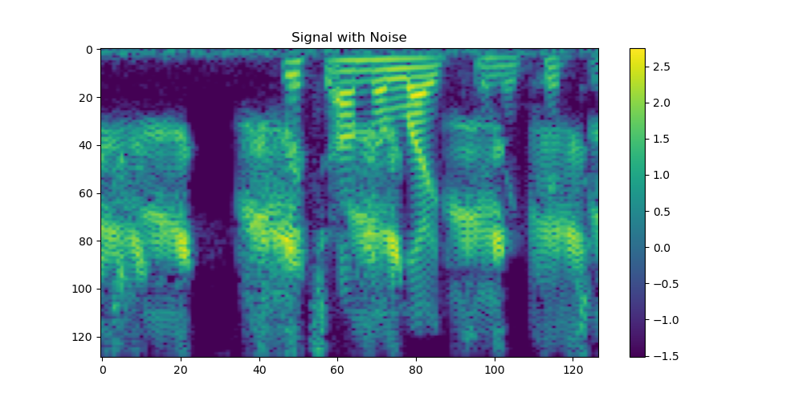

# Spectral Transformer

The **Spectral Transformer** repository demonstrates the versatility of transformer-based AI models in signal processing tasks, with a particular focus on **audio applications** like noise suppression. Unlike traditional transformer inputs consisting of tokenized text, this project adapts modern transformer architectures to work directly with **audio signals** represented as mel-spectrograms. The transformers are customized to accommodate this unique input format, enabling highly effective signal analysis and modification.

A key highlight is the integration of neural networks and digital signal processing (DSP) techniques. The results showcase the synergy of these approaches, achieving precise noise suppression while maintaining the **original signal's phase information**. Notably, this approach avoids the use of [vocoders](https://en.wikipedia.org/wiki/Phase_vocoder) for audio reconstruction, ensuring higher fidelity in the output.

Even with a relatively simple transformer network, excellent performance can be achieved in real-world scenarios, as illustrated by the following example. Using the challenging task of separating human speech from background noise (e.g., frog sounds), the network demonstrates its robustness. Specifically:

1. **Signal with Noise** (Figure 1): This represents the input noisy speech signal, containing both human speech and frog sounds.



2. **Signal without Noise** (Figure 2): This is the clean speech signal, used as a reference for comparison.


3. **Cleaned Signal with Noise** (Figure 3): This is the output of the network, showing its ability to effectively suppress noise and isolate the speech signal, even on out-of-sample data.


### Sample Audio

<audio controls>
  <source src="figures/result.wav" type="audio/wav">
  Your browser does not support the audio element.
</audio>


## Attention Mechanism
Understanding the [attention mechanism](https://arxiv.org/html/1706.03762v7) is crucial for adapting deep learning architectures to various input formats. While most explanations utilize a sequence × embedding input format, this discussion emphasizes the embedding × sequence format as implemented in [Julia](https://julialang.org/). Additionally, this documentation aims to provide a comprehensive overview of the concepts that may initially seem challenging, breaking them down in a clear and accessible manner. By doing so, it not only facilitates modifications to input/output processing but also ensures the provided code is both intuitive and adaptable.

The attention mechanism is a foundational concept in modern deep learning architectures, such as the Transformer. It enables models to focus on specific elements of an input sequence when generating an output, capturing the relationships between elements of the sequence. This section provides a step-by-step explanation of how the attention mechanism operates for **a single attention head**, starting with input representation as matrices, followed by transformations into **queries (Q)**, **keys (K)**, and **values (V)**—all of which are *learned* representations rather than direct input data. The similarities between **Q** and **K** are then measured using a dot product, yielding weights that indicate how relevant each position is relative to the current query. These weights are subsequently applied to **V**, allowing the model to focus on and aggregate information from different parts of the sequence. Each step is described in terms of the matrix operations that underlie the mechanism.

---

### 1. **Input Representation as a Matrix**

The input sequence is represented as a matrix:

Let the sequence have $n$ elements, each represented by a vector of dimension $d$. The input sequence is then represented as:

$$
X \in \mathbb{R}^{d \times n}
$$

where each column corresponds to the representation of an element in the sequence.

---

### 2. **Linear Transformations to Obtain Query, Key, and Value**

Each element of the input sequence is transformed into three separate representations: **query ($Q$)**, **key ($K$)**, and **value ($V$)** using weight matrices:

$$
Q = W_Q X \quad \text{where} \quad W_Q \in \mathbb{R}^{d_k \times d}
$$

$$
K = W_K X \quad \text{where} \quad W_K \in \mathbb{R}^{d_k \times d}
$$

$$
V = W_V X \quad \text{where} \quad W_V \in \mathbb{R}^{d_v \times d}
$$

Here:
- $d_k$ is the dimension of the query and key vectors.  
- $d_v$ is the dimension of the value vectors.

The weight matrices $W_Q$, $W_K$, and $W_V$ are trained during the learning process, with each attention head independently learning its own set of weights.

After the transformations:
- $Q \in \mathbb{R}^{d_k \times n}$,
- $K \in \mathbb{R}^{d_k \times n}$,
- $V \in \mathbb{R}^{d_v \times n}$.

---

### 3. **Attention Score Calculation**

The attention mechanism determines the relevance of each element in the sequence to every other element. This is done by computing a **similarity** score between queries and keys using a [dot product](https://en.wikipedia.org/wiki/Dot_product):

$$
\text{Attention Score} = K^T Q
$$

Where:
- $Q \in \mathbb{R}^{d_k \times n}$ (queries from all elements),
- $K^T \in \mathbb{R}^{n \times d_k}$ (keys transposed).

The result is:

$$
S \in \mathbb{R}^{n \times n}
$$

where $S_{ij}$ represents the relevance of the $j$-th element to the $i$-th element.

To stabilize training and avoid overly large values, these scores are scaled by $\sqrt{d_k}$:

$$
\text{Scaled Attention Score} = \frac{K^T Q}{\sqrt{d_k}}
$$

---

### 4. **Softmax to Compute Attention Weights**

The [softmax](https://en.wikipedia.org/wiki/Softmax_function) function is applied row-wise to the scaled attention scores to produce attention weights, ensuring that each row forms a probability distribution that sums to 1:

$$
A = \text{Softmax}\left(\frac{K^T Q}{\sqrt{d_k}}\right)
$$

For the $i$-th query, the attention weight for the $j$-th key is:

$$
A_{ij} = \frac{\exp(S_{ij})}{\sum_{k=1}^n \exp(S_{ik})}
$$

This results in the attention weights matrix $A \in \mathbb{R}^{n \times n}$, where each row represents how much each key contributes to the respective query.

---

### 5. **Weighted Sum Using Values**

The attention weights are used to compute a weighted sum of the value vectors:

$$
\text{Output} = V A
$$

Where:
- $V \in \mathbb{R}^{d_v \times n}$ (value representations),
- $A \in \mathbb{R}^{n \times n}$ (attention weights).

The result is:

$$
O \in \mathbb{R}^{d_v \times n}
$$

which is the output of the attention mechanism.

---

### Summary

In terms of matrix operations:

1. Compute query, key, and value matrices:

$$
Q = W_Q X, \quad K = W_K X, \quad V = W_V X
$$

2. Compute attention scores:

$$
S = \frac{K^T Q}{\sqrt{d_k}}
$$

3. Apply softmax to scores to get attention weights:

$$
A = \text{Softmax}(S)
$$

4. Compute the output as a weighted sum of values:

$$
O = V A
$$

## Multi-Head Attention Mechanism

To capture a diverse range of features and relationships in the input data, multi-head attention employs multiple attention "heads" that operate in parallel. Each head focuses on different aspects of the data by independently calculating attention outputs using its own learned weight matrices. This approach allows the model to process and integrate multiple perspectives simultaneously, enabling richer representations of the input.

### Parallel Attention Heads and Matrix Combination

Each of the $h$ attention heads computes its own output matrix:

$$
O_i = V_i A_i \quad \text{for } i = 1, 2, \dots, h,
$$

where $O_i \in \mathbb{R}^{d_v \times n}$ represents the output from the $i$-th attention head. To integrate these outputs, the results from all heads are stacked vertically into a single matrix:

$$
O_{\text{combined}} = 
\begin{bmatrix}
O_1 \\
O_2 \\
\vdots \\
O_h
\end{bmatrix} 
\in \mathbb{R}^{(h \cdot d_v) \times n}.
$$

This stacking operation forms a larger matrix where each attention head contributes a block of rows corresponding to its output. The result is a multi-faceted representation of the input that encapsulates the distinct features learned by each head.

### Dimensionality Constraints for Attention Heads

To ensure that the combined output aligns with the model's overall feature dimension $d$, the relationship between the number of attention heads ($h$), the dimension of each head’s output ($d_v$), and the total model dimension ($d$) must satisfy:

$$
h \cdot d_v = d,
$$

where:
- $d$ is the model’s total feature dimension,
- $h$ is the number of attention heads,
- $d_v$ is the feature dimension of each head.

This constraint ensures that the combined matrix $O_{\text{combined}}$ has a total of $d$ rows, regardless of how many heads are used. As the number of heads increases, the dimension of each head’s output ($d_v$) must decrease proportionally. This tradeoff balances the model's ability to focus on diverse features across heads with the capacity of individual heads to represent detailed patterns.

By stacking attention outputs in this way, multi-head attention integrates diverse insights from the input data while preserving a structured and scalable approach to feature representation.

## Attention Layer

The Transformer architecture, introduced in the paper [*Attention Is All You Need*](https://arxiv.org/html/1706.03762v7) (Vaswani et al., 2017), is built around the multi-head self-attention mechanism, supported by feed-forward layers and add and norm operations. This section focuses on these **support layers**, which, as shown in the architecture diagram below. 


### First Add and Norm Layer

The first add and norm layer integrates the output of the multi-head attention mechanism back into the network. Multi-head attention can be represented as a function:

$$
\text{MultiHeadAttention}(X)
$$

This function processes the input \( X \) through attention heads and combines their outputs into a single representation.

The add and norm layer then performs the following steps:

1. **Residual Connection**: Adds the original input \( X \) to the attention output:

$$
Y = X + \text{MultiHeadAttention}(X)
$$

2. **Layer Normalization**: [Normalizes](https://en.wikipedia.org/wiki/Normalization_(machine_learning)#Layer_normalization) the combined result for stability:

$$
Z = \text{LayerNorm}(Y)
$$

This operation can be written concisely as:

$$
Z = \text{LayerNorm}(X + \text{MultiHeadAttention}(X))
$$

It ensures stable gradients and prepares the output for further processing.

### Feed-Forward Layer

The feed-forward layer processes the normalized output $Z$ with two linear transformations and a ReLU activation:

1. **Linear Transformation and Activation**:

$$
H = \text{ReLU}(W_1 Z + b_1)
$$

where $W_1 \in \mathbb{R}^{d_\text{ffn} \times d}$ and $b_1 \in \mathbb{R}^{d_\text{ffn}}$. Typically, $d_\text{ffn}$ is set to **4 times** the input dimension $d$, allowing the layer to model more complex interactions.

2. **Second Linear Transformation**:

$$
F = W_2 H + b_2
$$

where $W_2 \in \mathbb{R}^{d \times d_\text{ffn}}$ and $b_2 \in \mathbb{R}^d$. This transformation reduces the dimension back to $d$, ensuring the output size remains consistent with the original input.

Finally, the result is integrated using another add and norm layer:

$$
\text{Output}_{\text{Attention Layer}} = \text{LayerNorm}(Z + F)
$$

**Why increase and then decrease the dimension?**  
Increasing the dimension to $d_\text{ffn}$ (typically $4d$) enables the model to capture richer and more complex features in a higher-dimensional space. Reducing the dimension back to $d$ ensures the output remains manageable and compatible with the rest of the architecture, while still benefiting from the complex intermediate representations.

---

### Summary of Attention Layer

1. **Multi-Head Attention**:

$$
\text{MultiHeadAttention}(X) = \text{Concat}(O_1, \dots, O_h) W_O, \quad O_i = \text{Softmax}\left(\frac{K_i^T Q_i}{\sqrt{d_k}}\right) V_i
$$

2. **Add and Norm**:

$$
Z = \text{LayerNorm}(X + \text{MultiHeadAttention}(X))
$$

3. **Feed-Forward**:

$$
F = \text{ReLU}(W_1 Z + b_1) W_2 + b_2
$$

4. **Second Add and Norm**:

$$
\text{Output}_{\text{Attention Layer}} = \text{LayerNorm}(X + F)
$$

The final output, $Output_{\text{Attention Layer}}$, represents the result of processing through the attention layer, integrating multi-head attention and feed-forward operations.

---

## Transformer Block

The system considered here is an **encoder**, composed of $N$ stacked **Transformer attention layers**, each integrating multi-head attention, feed-forward layers, and add and norm operations. These layers process input sequences into high-dimensional representations, making the encoder suitable for tasks like classification, sound processing, or summarization.

---

### Encoder and Decoder in the Original Transformer

The original Transformer architecture, as introduced in [*Attention Is All You Need*](https://arxiv.org/html/1706.03762v7), included both an encoder and a decoder:

1. **Encoder**:
   - Processes input sequences into high-dimensional representations.
   - Fully parallelizable, making it efficient for non-generative tasks.

2. **Decoder**:
   - Generates output sequences token by token, attending to both encoder outputs and previously generated tokens.
   - Requires an **attention mask** during training to prevent "looking ahead."

While encoder-decoder configurations are used for tasks like translation and summarization (e.g., **BART**), encoder-only systems simplify training and are ideal for tasks such as classification and sound processing. Decoder-only models, like **ChatGPT**, focus on text generation.

---

### Example: Instantiating an Encoder Block in Julia

Using [Transformers.jl](https://github.com/chengchingwen/Transformers.jl):

```julia
using Transformers

# Instantiate an encoder block
transformer_block = TransformerBlock(
    model_dim = 512,       # Model dimension (d)
    num_heads = 8,         # Attention heads
    ffn_dim = 2048,        # Feed-forward dimension (d_ffn)
    num_layers = 6         # Number of layers (N)
)
```

Frameworks like [Transformers.jl](https://github.com/chengchingwen/Transformers.jl) provide modular implementations, enabling easy customization of encoder blocks. This example demonstrates how to set up a stack of \( N \) attention layers for encoder-based tasks.